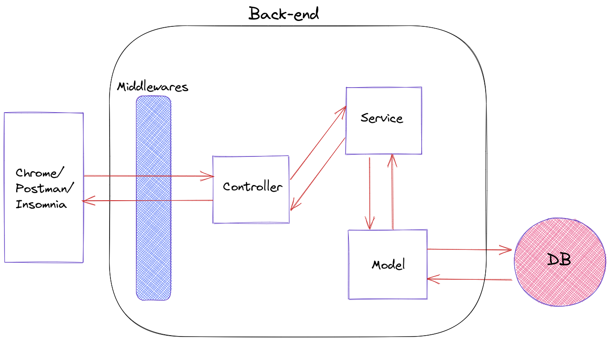

Este projeto contém os requisitos realizados por _[Anna Beatriz Garcia Trajano de Sá](www.linkedin.com/in/anna-beatriz-trajano-de-sá)_ enquanto estudava na [Trybe](https://www.betrybe.com/) :rocket:

# Project Store Manager

Neste projeto desenvolvi uma API utilizando a arquitetura MSC (model-service-controller)!

A API criada tinha como base um sistema de gerenciamento de vendas no formato dropshipping em que é possível criar, visualizar, deletar e 
atualizar produtos e vendas. Para gestão do banco de dados, utilizei o MySQL. Além disso, a API desenvolvida foi RESTful.

## Arquitetura de Software - MSC

MSC       
:-------------------------:|
  |

---

## Demo


---

## Instalação do projeto localmente:
 
Após cada um dos passos, haverá um exemplo do comando a ser digitado para fazer o que está sendo pedido, caso tenha dificuldades e o exemplo não seja suficiente, não hesite em me contatar em _annagarcia@id.uff.br_ 

1. Abra o terminal e crie um diretório no local de sua preferência com o comando **mkdir**:
```javascript
  mkdir projetos
```

2. Entre no diretório que acabou de criar e depois clone o projeto:
```javascript
  cd projetos
  git clone git@github.com:annabia95/project-store-manager.git
```

3. Acesse o diretório do projeto e depois utilize o comando **npm i** para instalar todas as dependências necessárias:
```javascript
  cd project-store-manager
  npm i
```

- ✨ **Dica:** Caso queira utilizar _Docker_ para rodar os testes localmente e validar as funcionalidades, basta seguir as seguintes instruções:

 **:warning: Antes de começar, seu docker-compose precisa estar na versão 1.29 ou superior. [Veja aqui](https://www.digitalocean.com/community/tutorials/how-to-install-and-use-docker-compose-on-ubuntu-20-04-pt) ou [na documentação](https://docs.docker.com/compose/install/) como instalá-lo. No primeiro artigo, você pode substituir onde está com `1.26.0` por `1.29.2`.**

  > :information_source: Rode os serviços `node` e `db` com o comando `docker-compose up -d`.
  - Lembre-se de parar o `mysql` se estiver usando localmente na porta padrão (`3306`), ou adapte, caso queria fazer uso da aplicação em containers;
  - Esses serviços irão inicializar um container chamado `store_manager` e outro chamado `store_manager_db`;
  - A partir daqui você pode rodar o container `store_manager` via CLI ou abri-lo no VS Code.

  >  :information_source: Use o comando `docker exec -it store_manager bash`.
  - Ele te dará acesso ao terminal interativo do container criado pelo compose, que está rodando em segundo plano.

  > :information_source: Instale as dependências [**Caso existam**] com `npm install`

  - **:warning: Atenção:** Caso opte por utilizar o Docker, **TODOS** os comandos disponíveis no `package.json` (npm start, npm test, npm run dev, ...) devem ser executados **DENTRO** do container, ou seja, no terminal que aparece após a execução do comando `docker exec` citado acima. 

  - **:warning: Atenção:** O **git** dentro do container não vem configurado com suas credenciais. Ou faça os commits fora do container, ou configure as suas credenciais do git dentro do container.

  - **:warning: Atenção:** Não rode o comando npm audit fix! Ele atualiza várias dependências do projeto, e essa atualização gera conflitos com o avaliador.


## Habilidades Desenvolvidas

Neste projeto, desenvolvi as seguintes habilidades:

 - Arquitetar e desenvolver a API com um banco de dados MySQL;
 - Desenvolver endpoints para criar, exibir, atualizar e excluir produtos e vendas;
 - Aplicar testes unitários em cada camada do modelo MSC.

 
 ## Referências
 
 [Documentação Oficial - Node.js](https://nodejs.org/en/docs/)<br>
 [Documentação Express - Rotas](https://expressjs.com/pt-br/guide/routing.html)<br>
 [Bulletproof node.js project architecture](https://dev.to/santypk4/bulletproof-node-js-project-architecture-4epf)<br>
 [Artigo Trybe: Teste unitário: o que são, por que usar e por onde começar?](https://blog.betrybe.com/tecnologia/testes-unitarios/)<br>
 
